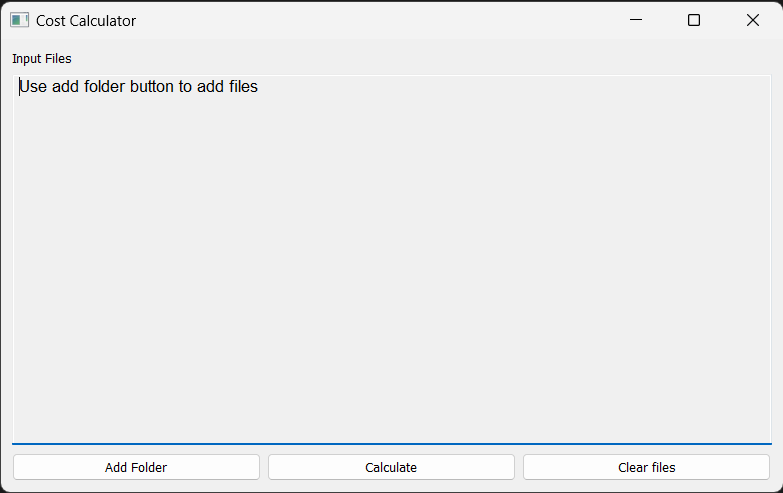

# Cost Calculator

### This is a small GUI application that calculates the total cost of invoices based on their filenames

## Build instruction

1. Make sure you the lastest Go installation and environment. Found [here](https://go.dev/doc/install)

2. Make sure you have the source code by either cloning the repo or downloading the zip file by pressing the green code button.
`git clone https://github.com/leon332157/costcalculator.git`

3. Extract and cd into the directory `cd costcalculator`
4. Automatically install all required dependencies by running `go mod download`
5. Build! `go build -x -ldflags="-H windowsgui"`
6. Run `costCalculator.exe`

## Usage instruction
1. Either build or download the binary from the release page.
2. When you open the application you will see a window like this: 

3. Click the Add Folder button, and select the folder.
4. The application will recursively scan all the files and folders in the selected folder, it will include files with the following pattern
`[any]_[integer/decimal].[3 char extension]`
5. After scanning, the input files textbox will display all the valid files, using sample files as an example

6. Click "Calculate", the total cost will be displayed in a message box

The textbox will display the corresponding cost for each file, please verify as well. 

7. Click add folder to add more files. Or use clear files to clear all the files. 

## Bug reporting
In case of an crash or a fatal error, a crash report should be generated at the directory the application is started. Please make an issue with the generated crashlog.
